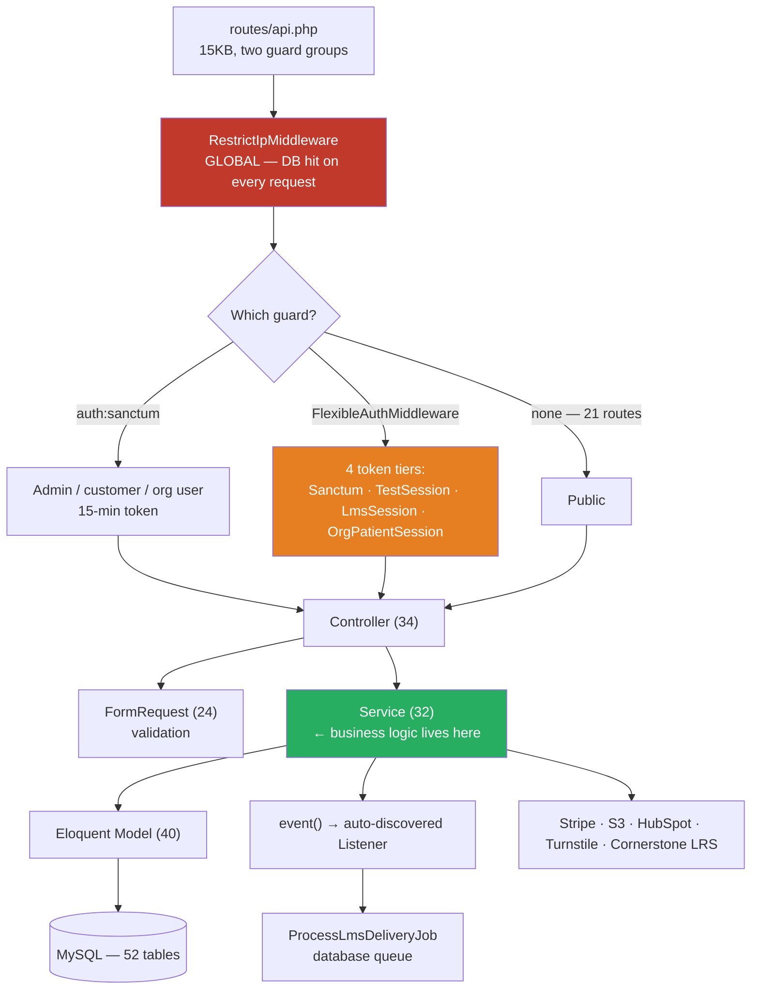

# Architecture Reality — What Exists vs. What's Wired

> **Read this before writing any code.** TCV-Backend is a *conventional-looking* Laravel app: almost
> every standard directory exists. That is exactly the trap. Several of those directories hold code
> that is **never reached**, and one provider that looks load-bearing **is not registered at all**.
> "The folder exists" is not evidence the layer runs. Everything below is verified against the
> filesystem and `bootstrap/providers.php`, not inferred from convention.

---

## Verified present and wired

| Layer | Count | Notes |
|---|---|---|
| Controllers | **34** | Thin-ish. Real logic mostly delegated to Services. |
| Services | **32** | **Where the business logic lives.** Includes an 11-class `Lms/` subtree. |
| Models | **40** | Eloquent, 69 declared relationships. |
| FormRequests | **24** | Validation is genuinely centralised here — follow this. |
| Middleware | **4** | One of them (`EnsureTokenIsValid`) is **dead** — see below. |
| Policies | **3** | `TestPolicy`, `OrgPolicy`, `CreditsPolicy` — registered via `AuthServiceProvider`. |
| Events / Listeners | **3 / 3** | Wired by **auto-discovery** + `LmsServiceProvider`, *not* by `EventServiceProvider`. |
| Jobs | **1** | `ProcessLmsDeliveryJob`, `database` queue driver. |
| Notifications | 3 | `ResetPasswordNotification`, `VerifyEmailNotification`, `OrganizationTestUrlNotification`. |
| Mail | 1 | `VerifyEmail` mailable. Most mail is sent as raw HTML instead — see below. |
| Exports | 3 | `maatwebsite/excel`. |
| Console commands | **1** | `UploadTestPlates`. **Nothing is scheduled.** |
| Rules | 1 | `TurnstileToken`. |
| Traits | 1 | `Searchable` — the shared query-search scope. |

---

## Verified present but **not wired**

This is the section that causes wrong code.

### 1. `EventServiceProvider` is never loaded

[`app/Providers/EventServiceProvider.php`](../../TCV-Backend/app/Providers/EventServiceProvider.php)
declares:

```php
protected $listen = [
    UserPasswordSet::class => [SendAfterPasswordReset::class],
];
```

…but [`bootstrap/providers.php`](../../TCV-Backend/bootstrap/providers.php) lists only
`AppServiceProvider`, `AuthServiceProvider`, `LmsServiceProvider`. **`EventServiceProvider` is not in
that list, so its `$listen` map registers nothing.**

The listener still fires — because Laravel 11+ **auto-discovers** any `app/Listeners` class whose
`handle()` type-hints an event, and `SendAfterPasswordReset::handle(UserPasswordSet $event)` matches.

**What this means for you:** adding a mapping to `EventServiceProvider` does **nothing**. Either
type-hint the event in the listener's `handle()` (auto-discovery), or add an explicit `Event::listen`
the way `LmsServiceProvider` does. Do not "fix" it by registering the provider without checking for
double-binding — auto-discovery would then fire the same listener twice.

Full picture: [INDEXES/EVENT_INDEX.md](INDEXES/EVENT_INDEX.md) · [EVENTS.md](EVENTS.md).

### 2. `EnsureTokenIsValid` middleware is dead

[`app/Http/Middleware/EnsureTokenIsValid.php`](../../TCV-Backend/app/Http/Middleware/EnsureTokenIsValid.php)
is never aliased in `bootstrap/app.php` and appears in no route. Deleting it is safe. Do not reach for
it when you need a guard — use `auth:sanctum` or `FlexibleAuthMiddleware` ([MIDDLEWARE.md](MIDDLEWARE.md)).

### 3. `app/Repositories` holds exactly one class

`EmailTemplateRepository` is the only repository. **There is no repository layer** — 39 of 40 models are
queried directly from controllers and services. Do not "follow the repository pattern"; there isn't
one. See [REPOSITORIES.md](REPOSITORIES.md).

### 4. `app/Mail` holds one mailable, but most mail bypasses it

`VerifyEmail` is the only Mailable. Real sending paths are:

| Path | Mechanism |
|---|---|
| Email verification (from `register()` since `ws-417`, previously `login()`) | `Mail::html()` with a body assembled from the **`email_template` DB table** |
| Password reset / setup | `ResetPasswordNotification` (a Notification) |
| Org test URL | `OrganizationTestUrlNotification` |
| Test resume link | `Mail::send('emails.dynamic-template', …)` with an inline heredoc body |

Four mechanisms for one concern. When you add an email, match the *nearest* existing path rather than
introducing a fifth.

A missing or `status != 'enable'` row used to fail **silently** in the verification path. `ws-417`
fixed that one: `sendVerificationEmailForUser()` now swallows only genuine
`TransportExceptionInterface` failures and rethrows everything else, instead of substring-matching the
message for `'mail'` — which matched *"**Email** verification template not found"* at offset 1 and
absorbed the misconfiguration. **The other DB-template paths have not been audited for the same
shape**; check the `catch` before assuming a template problem would surface.

**Every outgoing subject is branded at send time** by `App\Listeners\PrefixEmailSubject` on
`MessageSending` (`ws-417`) — the only hook that covers all four mechanisms above plus the DB-stored
subjects. See [EVENTS.md](EVENTS.md).

**Every DB-template path now ends in one shared cleanup step** — `App\Support\EmailContent::linkify()`
(`ws-373`, 2026-08-31 — merged into `ws-404` on 2026-09-01, not yet deployed). It runs **after**
placeholder substitution in `AuthController::sendVerificationEmailForUser()`,
`ResetPasswordNotification::toMail()` and `TestInvitationMailer::send()` (the invitation call site moved
there in `ws-404`; the merge deliberately kept both the extraction and this pass), and wraps
any bare `http(s)` URL left in the body in an `<a>`. It exists because the template bodies are edited
outside the app — by SQL and data migrations for `email_template`, and through the SPA's Quill editor
for `user_email_templates` / `test_email_templates`, which drops any markup outside its `formats`
whitelist. A stripped anchor leaves a plain-text URL that Outlook desktop does **not** auto-link.
`linkify()` is HTML-aware, not a regex over the whole body: it skips text already inside an `<a>`, text
inside `<style>`/`<script>`, and URLs sitting in an attribute. Adding a fifth sending path means
calling it too — see [CONTEXT/AUTH_CONTEXT.md](CONTEXT/AUTH_CONTEXT.md) and
[CONTEXT/INVITATION_CONTEXT.md](CONTEXT/INVITATION_CONTEXT.md).

### 5. Nothing is scheduled

`routes/console.php` registers only the stock `inspire` command, and there is no
`->withSchedule(...)` in `bootstrap/app.php`. `ProcessLmsDeliveryJob` is queued on the `database`
driver and **no queue worker service exists in either compose file** — so unless a worker runs
elsewhere, LMS deliveries sit in `jobs` unprocessed. See [QUEUES.md](QUEUES.md).

---

## The actual architecture

It is a **service-oriented Laravel app with an unusually wide authentication surface**:



### What this means for you

- **Start at the Service, not the controller.** `TestController` is 679 lines but most methods are a
  `try` → one service call → `ApiResponse`. The behaviour you want to change is in
  `TestExecutionService`, `TestAssignmentService`, `TestResultService` or `TestSectionProgressionService`.
- **Validation belongs in a FormRequest.** 24 of them exist and are used consistently. Adding inline
  `$request->validate()` in a controller that already has a FormRequest is the wrong shape — though
  note `AuthController` does exactly that throughout, because it predates the convention.
- **Authorisation is *not* uniform.** Three different mechanisms coexist:
  policies (`$this->authorize`, 20-odd call sites), inline `usertype` checks, and *nothing at all* on the
  session-token routes. See [AUTHORIZATION.md](AUTHORIZATION.md).
- **The response envelope is not uniform either.** `ApiResponse::success/error` emits
  `{success, status_code, message, data?}`, but `AuthController` returns hand-built shapes like
  `{status, message, access_token, user}` and `{valid, …}`. A client cannot assume one shape.
  See [CODING_GUIDELINES.md](CODING_GUIDELINES.md).

---

## Where the real seams are

Despite the inconsistencies, four genuine abstractions exist and **should** be used:

| Seam | Use it for | ID |
|---|---|---|
| `ApiResponse::success()` / `::error()` | Every new JSON response. Message keys live in `resources/lang/en/api.php`. | — |
| `App\Support\HttpStatus` | Status-code constants. Never a bare integer. | — |
| `LmsProviderRegistry` + `LmsProviderInterface` | Any new LMS integration. Register it in `LmsServiceProvider`. | `SVC-…` |
| `PaymentProviderInterface` + `BasePaymentProvider` | Any new payment provider. `StripeProvider` is the model. | `SVC-…` |

`Searchable` (the trait) is the fifth: it is how list endpoints implement `?search=`. Reuse it rather
than hand-rolling `where LIKE`.

---

## If you are tempted to add a layer

The codebase already has more layers than it consistently uses. Adding a repository layer to *one*
module makes it **less** consistent, not more — you would create a second pattern competing with 39
models' worth of the first.

The exception: a **new cross-cutting integration** (a second LMS provider, a second payment provider)
legitimately belongs behind the existing registry/interface seam. Follow `CornerstoneProvider` or
`StripeProvider` as the model.

---

_Verified 2026-08-19 against `TCV-Backend` `develop` (`85586469`) by filesystem check, provider-list
read and repo-wide grep — not by convention._
