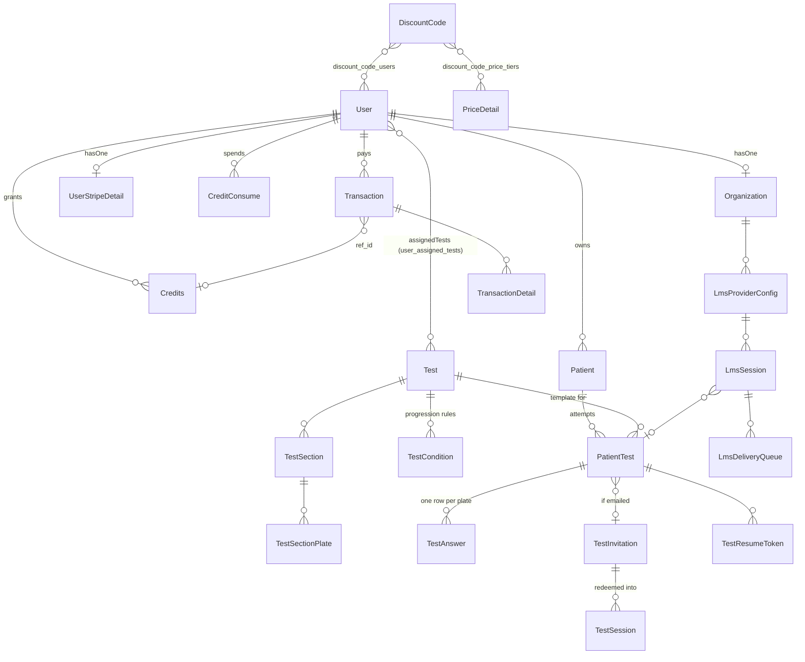

# Model Relationships

**69 declared relationships across 40 models.** The mechanical list, with line numbers, is
[INDEXES/MODEL_INDEX.md](INDEXES/MODEL_INDEX.md). This page is the shape and the traps.

## The core graph



## Pivot tables

| Pivot | Between | Declared on |
|---|---|---|
| `user_assigned_tests` | `User` ↔ `Test` | `User::assignedTests()`, `Test::assignedToUsers()` |
| `discount_code_users` | `DiscountCode` ↔ `User` | `DiscountCode::users()` |
| `discount_code_price_tiers` | `DiscountCode` ↔ `PriceDetail` | `DiscountCode::priceTiers()` |
| `user_hidden_tests` | `User` ↔ `Test` | ⚠️ **no relationship method declares it** — queried directly |
| `organization` ↔ `privileges` / `allowed_tests` | `Organization::privileges()`, `::allowedTests()` | |

## ☠️ Traps

1. **`TestAnswer` belongs to `Patient` and `Test`, but *not* to `PatientTest`.** It is joined to an
   attempt by the **string column `unique_test_id`**, with no relationship and no foreign key:
   ```php
   TestAnswer::where('unique_test_id', $uniqueTestId)->where('answered', 0)->exists();
   ```
   That string is the join key throughout `TestExecutionService`. You cannot write
   `$patientTest->testAnswers` — the relation does not exist.

2. **`PatientTest` pairs itself through `parent_test_id`, with no self-relation.** OS/OD partners are
   found by `PatientTest::where('parent_test_id', $x)->where('unique_test_id', '!=', $y)`.
   `getGroupedTests()` on the model is the sanctioned way to fetch the group — use it.

3. **`Credits::transactions()` is a `hasOne`** despite the plural name, and joins
   `Transaction.ref_id → credits.id`. Meanwhile `Transaction::credits()` is a `belongsTo` back. The
   naming reads backwards in both directions.

4. **`Credit` (singular) also relates to `User`** and maps to the same `credits` table as `Credits`.
   Its `user()` relation is real but the model is otherwise unused —
   [CREDITS_CONTEXT](CONTEXT/CREDITS_CONTEXT.md).

5. **`Organization` ↔ `User` is `hasOne`/`belongsTo` on `organizations.user_id`**, so an org's identity
   is split across two rows with independent lifecycles. Look up with
   `Organization::where('user_id', $id)` rather than assuming `$user->organization` is loaded — that is
   what `SendAfterPasswordReset` does.

6. **`LmsSession` reaches `PatientTest` through `unique_test_id`**, the same string key as `TestAnswer`.
   Three different subsystems join on that column; changing its format breaks all of them.

7. **`DiscountCodeUser` and `DiscountCodePriceTier` are full models on pivot tables.** Writing through
   the `belongsToMany` relations and writing through those models are two different paths to the same
   rows — `DiscountCodeService::syncRestrictions()` uses the relations. Prefer that.

8. **`user_hidden_tests` has no model and no relation.** It is queried inline. Grep for the literal table
   name when tracing test visibility.

## Eager-loading habits worth copying

The codebase is generally good about this:
```php
PatientTest::where('unique_test_id', $id)->with(['patient', 'test'])->lockForUpdate()->firstOrFail();
LmsSession::with(['providerConfig', 'patientTest'])->find($id);
TestAnswer::with(['testSectionPlate'])->where(…)->orderBy('display_order')->get();
```
Follow the pattern — the plate loop in particular is N+1-prone without `with('testSectionPlate')`.
