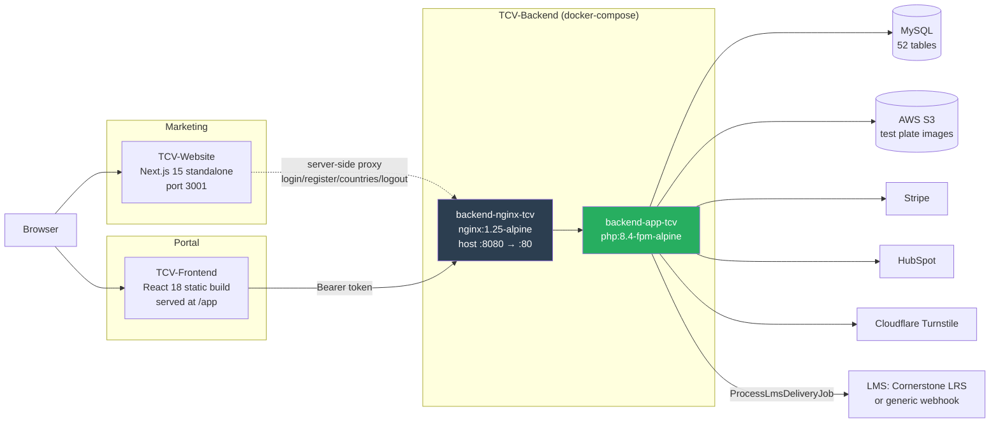

# System Architecture

## Runtime topology



## The backend container pair

`docker-compose.yml` defines exactly **two** services on an **external** network `tcv_network`:

| Service | Image | Notes |
|---|---|---|
| `backend-app-tcv` | `${IMAGE_TAG_BACKEND}` (built from the repo `Dockerfile`) | php-fpm; every config value arrives as an env var |
| `backend-nginx-tcv` | `nginx:1.25-alpine` | publishes host **8080** → 80; mounts `./nginx.conf` and `./public` |

☠️ **There is no MySQL service and no queue-worker service.** The database is external (`DB_HOST` from
the environment), and nothing consumes the `database` queue — see [QUEUES.md](QUEUES.md).

`storage/logs` is bind-mounted from the host at `/var/www/html/storage/logs`, so logs survive container
replacement ([LOGGING.md](LOGGING.md)).

## The image

Multi-stage `Dockerfile`:
1. **builder** — `php:8.4-fpm-alpine3.21`, installs `pdo_mysql mbstring exif pcntl bcmath gd zip`,
   runs `composer install --no-dev`, then `dump-autoload --optimize`.
2. **runtime** — the same base, recreates `www-data` as uid/gid **33**, copies extensions and the built
   app.

☠️ **The image is PHP 8.4; `composer.json` requires `^8.2`.** Local development on 8.2 or 8.3 will not
reproduce an 8.4-only behaviour. Check `php -v` before chasing an environment bug.

## Boot sequence (`entrypoint.sh`)

```
chown storage bootstrap/cache
APP_KEY set?        → else FATAL, exit 1
FRONTEND_URL set?   → else FATAL, exit 1        ← every patient-facing email link derives from it
config:clear · route:clear · cache:clear
config:cache · route:cache
php artisan migrate --force                     ← logs and CONTINUES on failure
exec php-fpm
```

Two things to internalise:
- **The `FRONTEND_URL` guard is deliberate.** Without it `config('app.frontend_app_url')` resolves to the
  host-less `"/app"`, and every verification / password-setup / resume / org Test URL link ships broken
  with no error. `AppServiceProvider::warnIfFrontendAppUrlLooksInvalid()` logs the same warning for
  environments started outside the entrypoint (`php artisan serve`).
- **A failed migration does not stop the boot.** You can get a healthy container on a half-migrated
  schema. Read the boot log.

Because `route:cache` runs at boot, **a routing change requires a container restart**, not just a code
deploy.

## nginx

`nginx.conf` sets a JSON access-log format, suppresses logging for `/health` and `/api/health`,
`client_max_body_size 500M` (test-plate uploads), and `server_tokens off`. Static assets are served from
the shared `./public` mount; PHP is proxied to `backend-tcv:9000`.

The **SPA and website are not served by this nginx** — `TCV-Frontend` carries its own `nginx.conf` and
`nginx.integration.conf` for that. In development the website's `next.config.mjs` rewrites `/app/*` and
`/api/*` instead ([WEBSITE.md](WEBSITE.md)).

## CI/CD

`.github/workflows/non-prod.yml` — "TCV Non-Production Pipeline (dev/qa)". Triggers on a **closed pull
request to `dev`** and on manual dispatch, with inputs for environment (`dev`/`qa`), AWS region,
`deploy_target` (`frontend` / `backend` / `both`), per-repo branch, and an optional
compliance/SBOM audit report.

☠️ **The trigger branch is `dev`, but both repos' default working branch is `develop`.** The dispatch
inputs default to `develop`. Confirm which branch you are actually deploying.

There is **no production workflow in this repo**.

## Where state lives

| State | Home |
|---|---|
| Relational data | external MySQL |
| Sessions, cache, queue | **the same MySQL** (`SESSION_DRIVER=database`, `CACHE_STORE=database`, `QUEUE_CONNECTION=database`) |
| Test plate images | S3, private, reached only via pre-signed URLs |
| Logs | `storage/logs`, bind-mounted |
| Secrets | environment variables, injected by the pipeline |

Redis and Memcached hosts are configured but **not used** by any driver default — the app is
MySQL-for-everything. That matters for capacity: cache and queue traffic land on the primary database.
